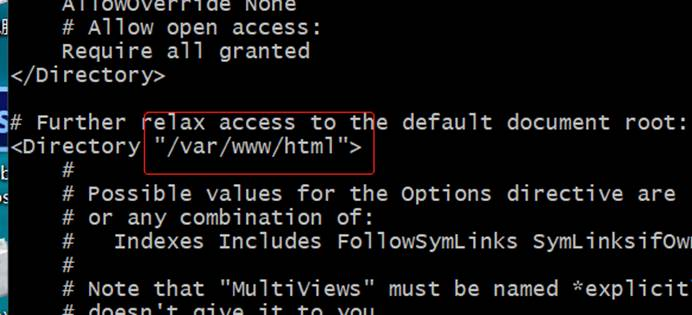
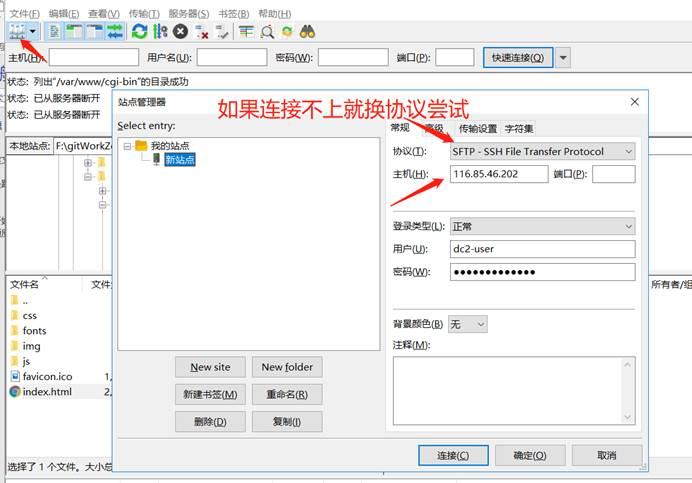
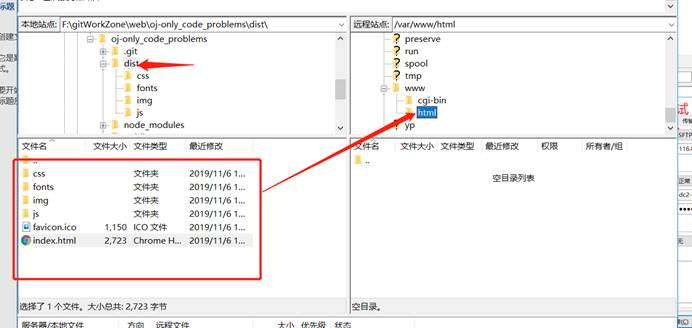

## linux centos7构建apahce服务器

## 0.将window连上linux服务器连上

前提是linux服务器已经启动服务

window安装git 然后ssh 用户名@ip 

eg:ssh dc2-user@116.85.46.202

## 1.安装apahce

网址：https://blog.csdn.net/qq_36811902/article/details/86004916

## 2.放置前端静态文件

2.1打包vue成dist文件夹npm run build

2.2查看/etc/httpd/conf里面的文件 cat httped.conf

2.3将window系统的dist文件夹里面的内容传输到linux

2.3.1下载FileZilla

2.3.2通过FileZilla将window连接到linux centos服务器

2.3.3将window文件上传到linux centos上/var/www/html下面

2.3将dist文件夹里面的内容全都放在这个/var/www/html目录下面 如图

2.4运行 输入：服务器ip地址 即可

## 时间：

2019/11/13

## 最后：

如果对你们有用麻烦点个start呀